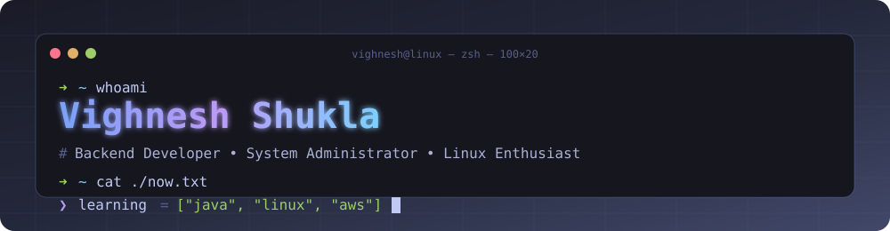

<!-- ════════════════════  CUSTOM ANIMATED BANNER  ════════════════════ -->

<p align="center">
  
</p>

<p align="center">
  
</p>

<p align="center">
  
  &nbsp;
  
  &nbsp;
  
  &nbsp;
  
  &nbsp;
  
</p>

&nbsp;

<!-- ════════════════════  NEOFETCH IDENTITY  ════════════════════ -->

<table align="center" border="0">
<tr>
<td valign="top" width="42%">

```bash
        vighnesh@github
        ───────────────
 OS      Arch Linux x86_64
 Host    github.com/SVIGHNESH
 Kernel  6.19-backend-dev
 Shell   zsh 5.9
 WM      tmux + vim
 Editor  vim / vscode
 Role    Backend • Sysadmin
 Uptime  learning since birth
 Mem     coffee: 99% used ☕
 ───────────────
 ████ ████ ████ ████
 ████ ████ ████ ████
```

</td>
<td valign="top" width="58%">

### 🧑‍💻 &nbsp;About Me

I'm **Vighnesh** — a Backend Developer & Sysadmin from India 🇮🇳 who lives inside terminals, loves Linux, and ships small things that work well.

- 🔭 Currently building **backend projects** and sharpening my sysadmin muscle
- 🌱 Leveling up in **Java**, **Linux internals**, **Docker**, **AWS**
- 💬 Ask me about **Linux**, **Bash**, **APIs**, **databases**
- 🎯 2026 Goal — contribute to one open-source infra project per quarter
- ⚡ Fun fact — the best debugger is a good night's sleep

<a href="https://instagram.com/svighnesh._"></a>
<a href="https://linkedin.com/in/vighnesh0"></a>
<a href="https://x.com/vighneshshukla0"></a>

</td>
</tr>
</table>

&nbsp;

<!-- ════════════════════  INTERACTIVE EASTER EGGS  ════════════════════ -->

<h2 align="center">🕹️ &nbsp;Interactive Terminal</h2>

<p align="center"><em>click any command to expand the output</em></p>

<details>
<summary><code>$ cat ~/.now</code> &nbsp; — what I'm doing <em>right now</em></summary>

```yaml
location:     India 🇮🇳
reading:      "The Linux Programming Interface" — M. Kerrisk
building:     a small REST API in Java + Spring Boot
automating:   my dotfiles with a single bash installer
listening:    lo-fi beats while debugging segfaults
next_up:      finally learning proper kubectl
```
</details>

<details>
<summary><code>$ ls ~/skills</code> &nbsp; — tech arsenal</summary>

<p align="center">
  <br/>
  <br/>
  
</p>
</details>

<details>
<summary><code>$ uname -a</code> &nbsp; — my setup</summary>

```
OS:       Arch Linux (btw)
Shell:    zsh + oh-my-zsh + starship
Terminal: Alacritty / Kitty
Editor:   Neovim (primary) · VS Code (when the mood strikes)
Fonts:    JetBrains Mono Nerd Font
Daily:    tmux, git, docker, htop, systemctl, journalctl
```
</details>

<details>
<summary><code>$ fortune</code> &nbsp; — a random dev quote</summary>

<p align="center">
  
</p>
</details>

&nbsp;

<!-- ════════════════════  TIMELINE  ════════════════════ -->

<h2 align="center">🔄 &nbsp;GitHub Repository Lifecycle</h2>

<p align="center">
  
</p>

&nbsp;

<!-- ════════════════════  METRICS (self-generated)  ════════════════════ -->

<h2 align="center">📈 &nbsp;Live Metrics</h2>

<p align="center">
  
</p>

&nbsp;

<!-- ════════════════════  STATS  ════════════════════ -->

<h2 align="center">📊 &nbsp;GitHub Statistics</h2>

<p align="center">
  
  
</p>

<p align="center">
  
</p>

<p align="center">
  
</p>

&nbsp;

<!-- ════════════════════  3D CONTRIB  ════════════════════ -->

<h2 align="center">🧊 &nbsp;3D Contribution Skyline</h2>

<p align="center">
  
</p>

&nbsp;

<!-- ════════════════════  SNAKE  ════════════════════ -->

<h2 align="center">🐍 &nbsp;Watch My Contributions Get Eaten</h2>

<p align="center">
  
</p>

&nbsp;

<!-- ════════════════════  ACTIVITY  ════════════════════ -->

<h2 align="center">📉 &nbsp;Contribution Activity</h2>

<p align="center">
  
</p>

&nbsp;

<!-- ════════════════════  SIGN-OFF  ════════════════════ -->

<p align="center">
  
</p>

<!--
  Banner           → ./assets/banner.svg                   (hand-crafted)
  Metrics          → .github/workflows/metrics.yml         (needs METRICS_TOKEN secret — PAT with read:user, repo)
  Snake animation  → .github/workflows/snake.yml           (publishes to 'output' branch)
  3D contrib graph → .github/workflows/3d-contrib.yml      (commits to ./profile-3d-contrib)
-->
