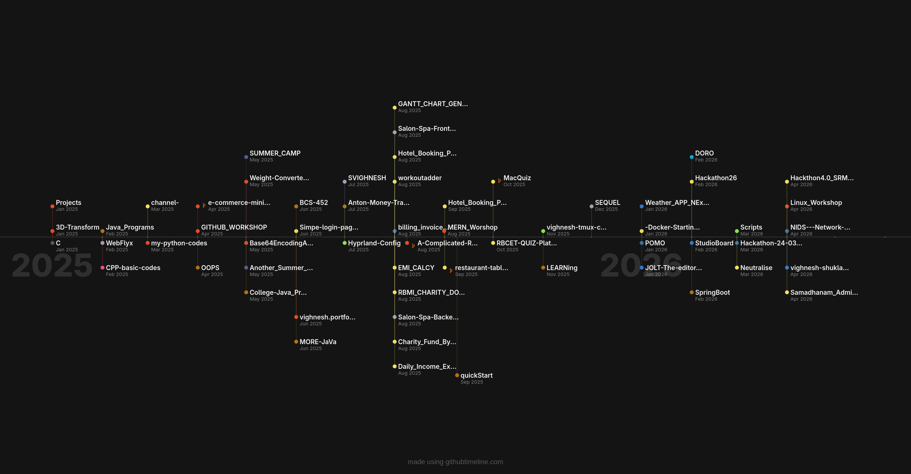

<!-- ══════════════════════════  HEADER  ══════════════════════════ -->

<p align="center">
  
</p>

<p align="center">
  
</p>

<p align="center">
  
  &nbsp;
  
  &nbsp;
  
</p>

&nbsp;

<!-- ══════════════════════════  ABOUT  ══════════════════════════ -->

<table align="center" border="0">
  <tr>
    <td width="55%" valign="top">

### &nbsp;🧑‍💻 &nbsp;About Me

I'm a **Backend Developer** and **System Administrator** from India 🇮🇳 who enjoys living in the terminal. I build APIs, tinker with servers, and automate anything that can be automated.

```yaml
role:       Backend Developer & Sysadmin
location:   India
learning:   Java • Linux • AWS
focus:      APIs • Servers • Automation
motto:      Make it work → right → fast.
```

- 🔭 Building backend projects & sharpening sysadmin skills
- 🌱 Exploring **Java**, **Linux internals**, and **Cloud**
- 💬 Ask me about **Linux**, **Bash**, or **APIs**
- ⚡ Fun fact: the best debugger is a good night's sleep

</td>
    <td width="45%" align="center" valign="top">
      
      <br/><br/>
      <a href="https://instagram.com/svighnesh._"></a>
      <a href="https://linkedin.com/in/vighnesh0"></a>
      <br/>
      <a href="https://x.com/vighneshshukla0"></a>
      <a href="https://github.com/SVIGHNESH"></a>
    </td>
  </tr>
</table>

&nbsp;

<!-- ══════════════════════════  TECH STACK  ══════════════════════════ -->


<h2 align="center">🧰 &nbsp;Tech Arsenal</h2>

<p align="center">
  <em>Languages</em><br/>
  
</p>

<p align="center">
  <em>Frameworks &nbsp;·&nbsp; Databases</em><br/>
  
</p>

<p align="center">
  <em>DevOps &nbsp;·&nbsp; Tools</em><br/>
  
</p>

&nbsp;

<!-- ══════════════════════════  TIMELINE  ══════════════════════════ -->

<h2 align="center">🔄 &nbsp;GitHub Repository Lifecycle</h2>

<p align="center">
  
</p>

&nbsp;

<!-- ══════════════════════════  STATS  ══════════════════════════ -->

<h2 align="center">📊 &nbsp;GitHub Statistics</h2>

<p align="center">
  
  
</p>

<!-- <p align="center">
  
</p> -->

<!-- <p align="center">
  
</p>

<p align="center">
   -->
</p>

&nbsp;

<!-- ══════════════════════════  SNAKE + QUOTE  ══════════════════════════ -->

<h2 align="center">🐍 &nbsp;Watch My Contributions Get Eaten</h2>

<p align="center">
  
</p>

<p align="center">
  
</p>

&nbsp;

<!-- ══════════════════════════  FOOTER  ══════════════════════════ -->

<p align="center">
  
</p>
