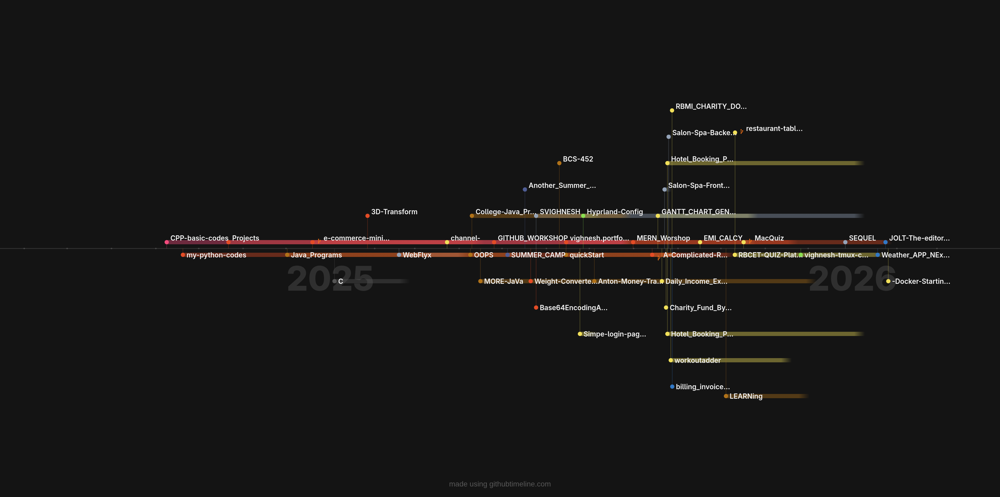

- 👋 Hi, I’m @SVIGHNESH
- 👀 I’m interested in the Backend and the System Admin Work...
- 🌱 I’m currently learning JaVa and the Linux...

<!-- -->

## 🌐 Socials:
   

# 💻 Tech Stack:
           
# 📊 GitHub Stats:
 
 

## 🏆 GitHub Trophies

<!-- Proudly created with GPRM ( https://gprm.itsvg.in ) -->
